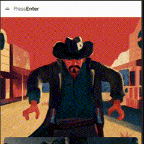

# PressEnter

This repository contains the code for the PressEnter website, a replica of the pressenter.group homepage.

Live link - https://pressenterjc.netlify.app/

## Overview

## Project Summary

- **Styling Organization:**

  - Maintained a tidy codebase by separating SCSS files.
  - Centralized variables and reset settings for easy management.

- **JavaScript Organization:**

  - Ensured clean and readable code for better understanding.
  - Adopted a modular structure, keeping code in separate files that connect to the main index for improved organization and manageability.

- **Responsive Design:**

  - Ensured a polished look on various devices using Bootstrap and SCSS.
  - Customized layouts with SCSS for a personalized touch.

- **Enhanced User Experience:**
  - Incorporated animations to elevate the visual appeal of interactive elements.
  - Created unique transitions for the hamburger icon.

## How to Run Locally

1. **Navigate to your Desktop**:

`cd Desktop`

2. **Clone the Repository**:

`git clone https://github.com/JavierLMB/PressEnter.git`

3. **Install the project dependencies**:

`npm install`

4. **Run locally**

`npm run dev`

This command will start a development server and open the project in your default web browser.

Additionally, if you would like to further inspect the code, you can find the PressEnter folder from your desktop and open it in an IDE.
